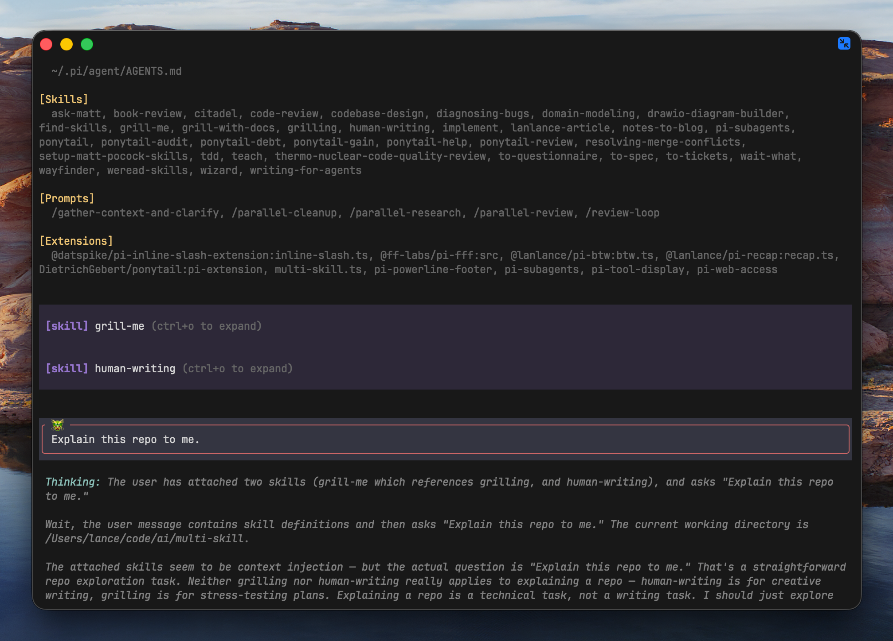

<div align="center">


**Stack multiple `/skill:` references in one message — one turn, one chip per skill.**

[](LICENSE)
[](https://github.com/L2ncE/pi-multi-skill/actions/workflows/ci.yml)

[中文说明](README_zh.md)

</div>

## What Is This

pi invokes one skill per message, and only at the very start of the first
line. A newline after `/skill:name` even makes the core parser silently
degrade the whole message to plain text.

This extension makes the natural multi-line form just work — **no new
syntax to remember**:

```
/skill:grill-me
/skill:human-writing

Explain this repo to me.
```

Submit once: each `/skill:` reference becomes its own collapsible
`[skill]` chip, followed by the remaining text as your message — and the
whole stack reaches the model in a **single turn**, no intermediate
"skill loaded" rounds.

References work anywhere in the message — a standalone line (leading,
middle, or trailing) or a trailing token after prose:

```
Add an AGENTS.md to this project please /skill:writing-for-agents

This is a multi-repo working directory and needs an index
```



## Behavior

| Input | Result |
|---|---|
| leading `/skill:a` / `/skill:b` lines + body (multi-line) | one `[skill]` chip each + body message — handled by this extension |
| single `/skill:a` + body on following lines | skill chip + body — also repairs the core newline gap |
| `/skill:a` trailing prose (`… please /skill:a`) | chip + body with the reference stripped — handled by this extension |
| standalone `/skill:a` line in the middle/at the end | chip + remaining body — handled by this extension |
| `/skill:a args` on one line | untouched core behavior (chip + args) |
| bare `/skill:a` on one line | untouched core behavior |
| reference mid-line (text after it) | treated as plain text, no interception |
| unknown skill name | reference stays in the text (no interception, no partial sends) |
| messages with images | passed through to core |

## Install

```bash
pi install npm:@lanlance/pi-multi-skill
```

or via git:

```bash
pi install git:https://github.com/L2ncE/pi-multi-skill
```

or try without installing:

```bash
pi -e /path/to/pi-multi-skill/extensions/multi-skill.ts
```

## How It Works

1. An `input` event handler extracts line-ending skill references
   (standalone lines or trailing tokens after prose) and takes over the
   submission (`{ action: "handled" }`).
2. Skill names resolve against `api.getCommands()` (`skill:*` entries) —
   user, project, and package sources are all covered.
3. Blocks are built with the exact format the core `/skill:` expansion
   produces, so the standard renderer draws the collapsible chips.
4. Every block plus the body is sent as ONE custom message (`triggerTurn`
   fires a single turn); the custom renderer reuses the core parser and
   chip component for each block.

Pure public extension APIs (`on`, `sendMessage`, `getCommands`,
`registerMessageRenderer`, and the officially exported `parseSkillBlock` /
`stripFrontmatter` rendering components). No editor wrapping, no private
seams, no conflict with other editor extensions.

## License

Apache-2.0
